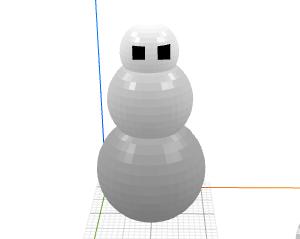

# How to Craft a Snowman?

Let's build a snowman!

The snowman has three parts: head, body, and legs, and they are stacked vertically.
For each part, we can use a `<part>` tag to define what the part should look like.
A meaningful name is assigned to each `<part>` tag, like `name="head"`. Then, we
can describe how the three parts should be stacked using a `<stack>` tag. Note
that a negative spacing is used (i.e., `space="-4"`) to allow the three parts to
overlap (so that they can be printed in one piece later).


<part name="head">
  <sphere/>
</part>
<part name="body">
  <sphere/>
</part>
<part name="legs">
  <sphere/>
</part>

<stack spacing="-4">
  <head/>
  <body/>
  <legs/>
</stack>


After we've designed the snowman's overall structure, it's time to size the individual
parts so that it looks like a snowman, who should have bigger lower parts and
a relatively small head. To do this, we can utilize the transform command `scale()`.
Here, we add `scale(1.5)` to `<body>` to make the body 1.5 times large. We add
`scale(2)` to make the feet 2 times bigger. It does start to look more like a snowman.


<part name="head">
  <sphere/>
</part>
<part name="body">
  <sphere/>
</part>
<part name="legs">
  <sphere/>
</part>

<stack spacing="-4">
  <head/>
  <body t="scale(1.5)"/>
  <legs t="scale(2)"/>
</stack>


Let's add some details. How about a pair of eyes? They should be added to
the head part. We can simply modify the content inside the `<part name="head">`
tag without touching the rest of the code. Here, we model the eyes using
a row of cubes, and we use the `position()` command to put the eyes
at the right place on the sphere.


<part name="head">
  <sphere/>
  <row spacing="2" t="position(2.5 8 5)">
    <cube size="2 2 2"/>
    <cube size="2 2 2"/>
  </row>
</part>
<part name="body">
  <sphere/>
</part>
<part name="legs">
  <sphere/>
</part>

<stack spacing="-4">
  <head/>
  <body t="scale(1.5)"/>
  <legs t="scale(2)"/>
</stack>


Finally, let's add some colors to make the snowman look pretty! To do so,
we can add a `

<part name="head">
  <sphere/>
  <row spacing="2" t="position(2.5 8 5)" id="eyes">
    <cube size="2 2 2"/>
    <cube size="2 2 2"/>
  </row>
</part>
<part name="body">
  <sphere/>
</part>
<part name="legs">
  <sphere/>
</part>

<stack spacing="-4">
  <head/>
  <body t="scale(1.5)"/>
  <legs t="scale(2)"/>
</stack>


Done! We have a snowman!
